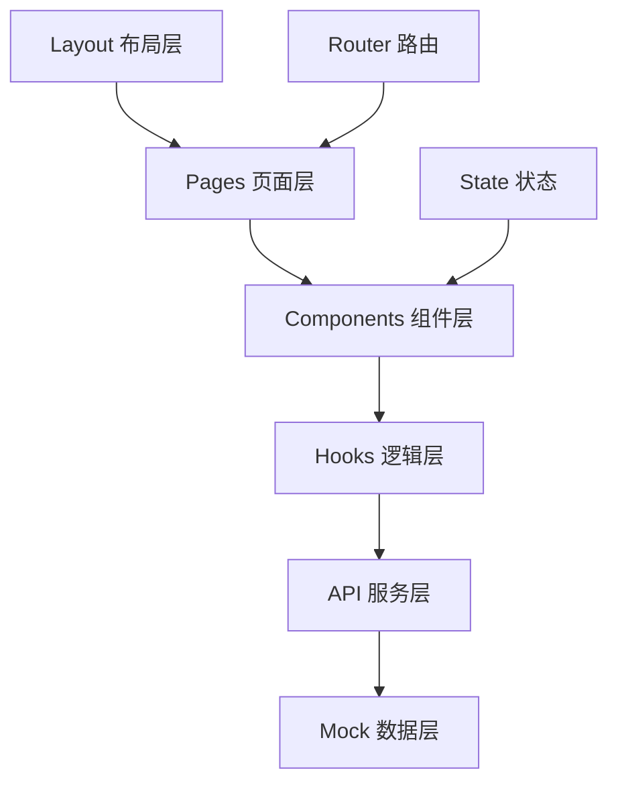

# 技术设计

## 需求追溯
基于 requirements.md 中的需求：
- FR-001 首页仪表盘 → Dashboard 组件 + 数据统计卡片
- FR-002 日程管理 → Calendar 组件 + Schedule 管理
- FR-003 审批流程 → Approval 组件 + 流程状态管理
- FR-004 通讯录管理 → Contacts 组件 + 组织架构树
- FR-005 车辆管理 → Vehicle 组件 + 状态筛选
- FR-006 AI 智能问答 → Chat 组件 + 对话历史
- FR-007 系统布局和导航 → Layout 组件 + 路由配置

## 布局设计

**布局模式**: `dashboard`

**布局结构**:
- 顶部导航栏：固定高度 64px，包含 Logo、搜索框、通知、用户头像
- 左侧菜单：固定宽度 240px，可折叠，包含六个功能模块入口
- 主内容区：自适应剩余空间，各模块页面内容区域
- 响应式适配：PC 端优先，最小宽度 1200px

## 系统架构



## 组件设计

### Layout 组件
- **职责**: 提供系统整体布局框架
- **文件**: `src/components/Layout/index.tsx`
- **Props**:
  ```typescript
  interface LayoutProps {
    children: React.ReactNode;
  }
  ```

### Dashboard 组件
- **职责**: 首页仪表盘数据展示
- **文件**: `src/pages/Dashboard/index.tsx`
- **子组件**: StatCard、TodoList、NoticeCarousel、QuickActions

### Calendar 组件
- **职责**: 日程管理和日历视图
- **文件**: `src/pages/Schedule/index.tsx`
- **子组件**: CalendarView、ScheduleForm、ScheduleList

### Approval 组件
- **职责**: 审批流程管理
- **文件**: `src/pages/Approval/index.tsx`
- **子组件**: ApprovalTabs、ApprovalList、ApprovalDetail、ApprovalForm

### Contacts 组件
- **职责**: 通讯录和组织架构
- **文件**: `src/pages/Contacts/index.tsx`
- **子组件**: OrgTree、EmployeeList、EmployeeDetail、SearchBar

### Vehicle 组件
- **职责**: 车辆管理和状态监控
- **文件**: `src/pages/Vehicle/index.tsx`
- **子组件**: VehicleList、VehicleCard、StatusFilter、VehicleDetail

### Chat 组件
- **职责**: AI 智能问答交互
- **文件**: `src/pages/Chat/index.tsx`
- **子组件**: ChatWindow、MessageList、InputArea、QuickQuestions

### useDashboard Hook
- **职责**: 仪表盘数据管理
- **文件**: `src/hooks/useDashboard.ts`
- **返回值**:
  ```typescript
  interface UseDashboardReturn {
    stats: DashboardStats;
    todos: TodoItem[];
    notices: Notice[];
    loading: boolean;
  }
  ```

### useSchedule Hook
- **职责**: 日程数据管理
- **文件**: `src/hooks/useSchedule.ts`
- **返回值**:
  ```typescript
  interface UseScheduleReturn {
    events: ScheduleEvent[];
    loading: boolean;
    createEvent: (event: CreateEventDto) => Promise<void>;
    updateEvent: (id: string, event: UpdateEventDto) => Promise<void>;
    deleteEvent: (id: string) => Promise<void>;
  }
  ```

## API 设计

### API 策略

**当前项目策略**: Mock 数据

由于系统包含 6 个复杂功能模块，涉及多实体关联（用户、部门、日程、审批、车辆等），选择 Mock 数据策略以支持完整的 CRUD 操作演示。

### API 端点设计

| 端点 | 方法 | 描述 | Mock 数据示例 |
|------|------|------|--------------|
| `/api/dashboard/stats` | GET | 获取仪表盘统计 | `{todos: 5, approvals: 3, meetings: 2}` |
| `/api/schedule/events` | GET | 获取日程列表 | `{data: [{id: 1, title: "会议", date: "2024-01-01"}]}` |
| `/api/schedule/events` | POST | 创建日程 | `{id: 1, title: "新会议", ...}` |
| `/api/schedule/events/:id` | PUT | 更新日程 | `{id: 1, title: "更新会议", ...}` |
| `/api/schedule/events/:id` | DELETE | 删除日程 | `{success: true}` |
| `/api/approval/list` | GET | 获取审批列表 | `{data: [{id: 1, type: "leave", status: "pending"}]}` |
| `/api/approval/:id/approve` | POST | 审批操作 | `{id: 1, status: "approved"}` |
| `/api/contacts/org` | GET | 获取组织架构 | `{data: [{id: 1, name: "技术部", children: [...]}]}` |
| `/api/contacts/employees` | GET | 获取员工列表 | `{data: [{id: 1, name: "张三", dept: "技术部"}]}` |
| `/api/vehicles` | GET | 获取车辆列表 | `{data: [{id: 1, plate: "京A12345", status: "available"}]}` |
| `/api/chat/send` | POST | 发送消息 | `{reply: "这是AI回复", timestamp: "2024-01-01"}` |

## 数据模型

```typescript
// 用户相关
interface User {
  id: string;
  name: string;
  avatar: string;
  department: string;
  position: string;
  phone: string;
  email: string;
}

// 仪表盘统计
interface DashboardStats {
  todoCount: number;
  approvalCount: number;
  meetingCount: number;
  noticeCount: number;
}

// 日程事件
interface ScheduleEvent {
  id: string;
  title: string;
  description: string;
  startTime: string;
  endTime: string;
  type: 'work' | 'meeting' | 'personal';
  reminder: boolean;
  attendees?: string[];
}

// 审批流程
interface ApprovalItem {
  id: string;
  type: 'leave' | 'expense' | 'purchase';
  title: string;
  applicant: string;
  status: 'pending' | 'approved' | 'rejected';
  createTime: string;
  content: string;
  amount?: number;
}

// 组织架构
interface Department {
  id: string;
  name: string;
  parentId?: string;
  children?: Department[];
  employees?: User[];
}

// 车辆信息
interface Vehicle {
  id: string;
  plate: string;
  model: string;
  status: 'available' | 'in-use' | 'maintenance' | 'charging';
  mileage: number;
  battery?: number;
  location: string;
  driver?: string;
}

// 聊天消息
interface ChatMessage {
  id: string;
  content: string;
  sender: 'user' | 'ai';
  timestamp: string;
}
```

## 状态管理

使用 React Hooks 进行状态管理：

```typescript
// 全局用户状态
interface UserState {
  currentUser: User | null;
  isLoggedIn: boolean;
}

// 应用 UI 状态
interface UIState {
  sidebarCollapsed: boolean;
  currentRoute: string;
  loading: boolean;
}

// 各模块独立状态管理
interface ModuleStates {
  dashboard: DashboardState;
  schedule: ScheduleState;
  approval: ApprovalState;
  contacts: ContactsState;
  vehicle: VehicleState;
  chat: ChatState;
}
```

## 错误处理

| 错误类型 | 用户提示 | 处理方式 |
|----------|----------|----------|
| 网络错误 | 网络连接失败，请检查网络 | 显示重试按钮 |
| 服务器错误 | 服务器暂时不可用 | 显示重试按钮 |
| 数据验证错误 | 请检查输入信息 | 高亮错误字段 |
| 权限错误 | 您没有权限执行此操作 | 显示提示信息 |
| 操作失败 | 操作失败，请稍后重试 | 显示错误提示 |

## 文件结构

```
src/
├── components/           # 可复用组件
│   ├── Layout/          # 布局组件
│   ├── StatCard/        # 统计卡片
│   ├── SearchBar/       # 搜索组件
│   └── common/          # 通用组件
├── pages/               # 页面组件
│   ├── Dashboard/       # 仪表盘
│   ├── Schedule/        # 日程管理
│   ├── Approval/        # 审批流程
│   ├── Contacts/        # 通讯录
│   ├── Vehicle/         # 车辆管理
│   └── Chat/            # AI 问答
├── hooks/               # 自定义 Hooks
│   ├── useDashboard.ts  # 仪表盘逻辑
│   ├── useSchedule.ts   # 日程逻辑
│   ├── useApproval.ts   # 审批逻辑
│   ├── useContacts.ts   # 通讯录逻辑
│   ├── useVehicle.ts    # 车辆逻辑
│   └── useChat.ts       # 聊天逻辑
├── services/            # API 服务
│   ├── dashboard.ts     # 仪表盘 API
│   ├── schedule.ts      # 日程 API
│   ├── approval.ts      # 审批 API
│   ├── contacts.ts      # 通讯录 API
│   ├── vehicle.ts       # 车辆 API
│   └── chat.ts          # 聊天 API
├── mocks/               # Mock 数据
│   ├── dashboard.ts     # 仪表盘数据
│   ├── schedule.ts      # 日程数据
│   ├── approval.ts      # 审批数据
│   ├── contacts.ts      # 通讯录数据
│   ├── vehicle.ts       # 车辆数据
│   └── chat.ts          # 聊天数据
├── types/               # 类型定义
│   └── index.ts         # 统一类型导出
├── utils/               # 工具函数
│   ├── request.ts       # 请求封装
│   ├── format.ts        # 格式化工具
│   └── constants.ts     # 常量定义
├── styles/              # 样式文件
│   └── global.css       # 全局样式
└── App.tsx              # 应用入口
```

## 路由设计

```typescript
const routes = [
  { path: '/', component: Dashboard, title: '首页' },
  { path: '/schedule', component: Schedule, title: '日程管理' },
  { path: '/approval', component: Approval, title: '审批流程' },
  { path: '/contacts', component: Contacts, title: '通讯录' },
  { path: '/vehicle', component: Vehicle, title: '车辆管理' },
  { path: '/chat', component: Chat, title: 'AI 助手' },
];
```

## 性能优化策略

1. **组件懒加载**: 使用 React.lazy 对页面组件进行懒加载
2. **数据缓存**: 使用 React Query 或 SWR 缓存 API 数据
3. **虚拟滚动**: 长列表使用虚拟滚动优化性能
4. **防抖搜索**: 搜索功能使用防抖优化
5. **图片优化**: 使用 WebP 格式和懒加载
