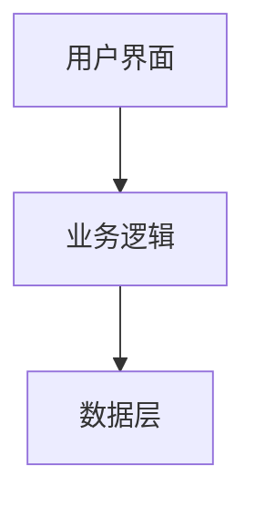

# 技术设计

## 需求追溯
基于 requirements.md 中的需求：
- FR-001 [需求名称] → [设计方案/组件]
- FR-002 [需求名称] → [设计方案/组件]

## 现有实现分析（旧项目必须）

**⚠️ 如果 project_type == "existing"，必须包含此部分！**

### 已实现功能
| 功能 | 实现文件 | 状态 | 说明 |
|------|----------|------|------|
| [功能1] | `src/xxx.tsx` | ✅ 完整 | [说明] |
| [功能2] | `src/xxx.tsx` | ⚠️ 部分 | [缺少什么] |

### 需要新增/修改的功能
| 需求 | 现状 | 工作量 |
|------|------|--------|
| FR-001 | [现状描述] | 小/中/大 |

### 可复用的代码
- [组件/Hook 名称] - [可如何复用]

## 布局设计

**布局模式**: `dashboard` / `full-width` / `centered`

| 布局模式 | 适用场景 | 根容器样式 |
|----------|----------|-----------|
| `dashboard` | 管理后台/仪表盘 | `height: 100vh; display: flex;` |
| `full-width` | 列表/表格页面 | `height: 100vh; overflow: auto;` |
| `centered` | 游戏/工具/登录/表单 | `height: 100vh; display: flex; flex-direction: column;` |

**布局结构**:
- 参考 `.kiro/templates/ui-standards/default-design-system.md` 第 8 章
- [具体布局说明]

## 系统架构



## 组件设计

### [组件名称]
- **职责**: [说明]
- **文件**: `src/components/xxx.tsx`
- **Props**:
  ```typescript
  interface XxxProps {
    prop1: string;
    prop2: number;
    onAction?: () => void;
  }
  ```

### [Hook 名称]
- **职责**: [说明]
- **文件**: `src/hooks/xxx.ts`
- **返回值**:
  ```typescript
  interface UseXxxReturn {
    data: T[];
    loading: boolean;
    error: string | null;
  }
  ```

## API 设计

### API 策略

| 策略 | 适用场景 | 选择条件 |
|------|----------|----------|
| **Mock 数据** | 原型/演示/简单功能 | 无后端、功能简单（≤3个实体） |
| **Mock 服务** | 复杂 CRUD、多实体关联 | 无后端、功能复杂（>3个实体） |
| **真实 API** | 已有后端 | 提供了 API 文档/Swagger/后端地址 |

**当前项目策略**: [Mock 数据 / Mock 服务 / 真实 API]

### API 端点设计

| 端点 | 方法 | 描述 | Mock 数据示例 |
|------|------|------|--------------|
| `/api/xxx` | GET | [描述] | `{data: [...]}` |
| `/api/xxx` | POST | [描述] | `{id: 1, ...}` |

## 数据模型

```typescript
interface Entity {
  id: number;
  name: string;
  createdAt: Date;
}
```

## 状态管理

```typescript
interface AppState {
  data: DataState;
  ui: UIState;
}
```

## 错误处理

| 错误类型 | 用户提示 | 处理方式 |
|----------|----------|----------|
| 网络错误 | 网络连接失败，请检查网络 | 显示重试按钮 |
| 服务器错误 | 服务器暂时不可用 | 显示重试按钮 |
| 验证错误 | [具体提示] | 高亮错误字段 |

## 文件结构

```
src/
├── components/
│   └── [组件].tsx
├── hooks/
│   └── [Hook].ts
├── api/
│   └── [API].ts
├── mocks/
│   └── data.ts
├── types/
│   └── index.ts
└── pages/
    └── [页面].tsx
```
